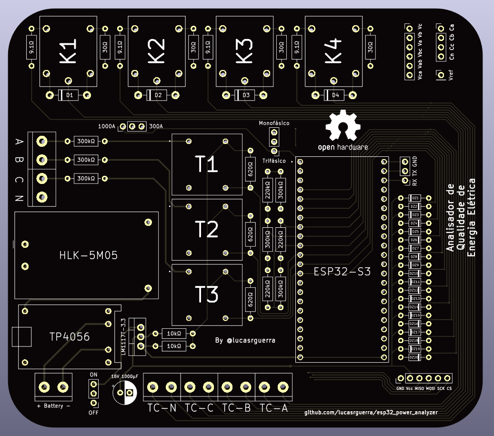
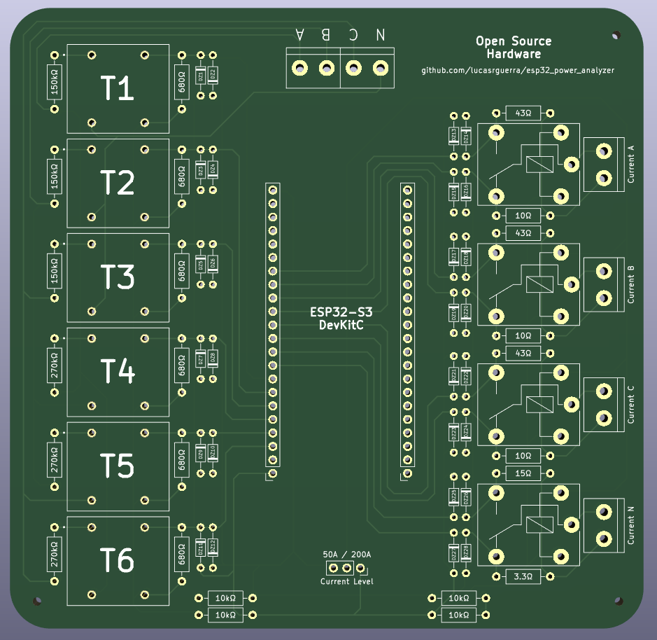

# Placas do projeto

## Descrição

Nesta pasta estão todos os arquivos das placas desenvolvidas para este projeto utilizando o software KiCAD. Dentre esses arquivos, estão o esquemático, o layout da placa e seus arquivos de fabricação no formato Gerber.

## Versões Disponíveis

- **[`v2.1`](./v2.1/)**: Essa é a sexta versão da placa e no modelo THT (Through-Hole Technology).
- **[`v2.0`](./v2.0/)**: Essa é a quinta versão da placa e no modelo THT (Through-Hole Technology).
- **[`v1.1`](./v1.1/)**: Essa é a quarta versão da placa e no modelo THT (Through-Hole Technology).
- **[`v1.0`](./v1.0/)**: Essa é a terceira versão da placa e no modelo THT (Through-Hole Technology).
- **[`v0.7`](./v0.7/)**: Essa é a segunda versão da placa e no modelo SMT (Surface-Mount Technology).
- **[`v0.5`](./v0.5/)**: Essa é a primeira versão da placa e no modelo THT (Through-Hole Technology).

## Dados das Placas

### Placa v2.1 (THT) - 139,700 x 116,840 mm (Atual)

Essa placa foi desenvolvida para ser mais compacta e organizada que a anterior. Além disso, ela possui pequenas correções, como a seleção manual do nível de corrente a ser utilizado nas medições e também  a largura de cada trilha da placa, aumentando a largura de trilhas com maior corrente. Nessa placa a cor da placa também foi alterada para preto.

### Placa v2.1 (THT) - 144,780 x 101,419 mm

Essa placa possui um menos transformadores de potencial, mas tem agora um circuito resposável pelo gerenciamento da energia utilizada na placa, com suporte para baterias 18650 de Ion-Lítion, um seleção de níveis de corrente, sendo eles 300A e 1000A, e suporte a módulos de cartão SD. Além disso, a placa possui um layout mais organizado que as anteriores. Além disso, ela possui pequenas correções, como a adição de um diodo retificador para proteção do circuito de seleção de níveis de corrente e a correção do identificador de todos os componentes no Footprint.

### Placa v1.1 (THT) - 143,510 x 73,025 mm

Essa placa possui o mesmo layout da anterior. Porém, foram corrigidos os nomes dos Diodos Zener no Footprint e foi adicionado um Diodo Retificador para proteção do circuito de seleção de níveis de corrente.

### Placa v1.0 (THT) - 143,510 x 73,025 mm

Essa placa possui um layout mais compacto e organizado que as anteriores, além de ter a conexão entre o ESP32-S3 e o módulo de interrupção de níveis de corrente. E os níveis de corrente dessa placa são 30A e 100A, possibilitando uma leiura mais precisa e adequada ao sensor utilizado, especialmente em baixas correntes.

### Placa v0.7 (SMT) - 90,170 x 82,423 mm

Essa placa possui um layout mais compacto e organizado que a primeira versão. Porém, ele não possui a seleção de níveis de corrente, lendo apenas na escala de 100A.

### Placa v0.5 (THT) - 119,380 x 116,840 mm

Essa placa possui um layout menos compacto e organizado. Além disso, ela possui a seleção de níveis de corrente, lendo na escala de 50A e 200A.
