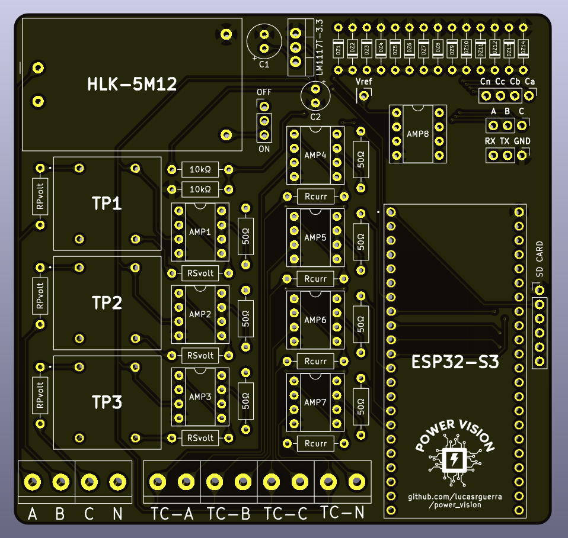

# Documentação do ESP32 Power Analyzer

Bem-vindo à documentação oficial do ESP32 Power Analyzer. Este documento fornece informações detalhadas sobre como usar, configurar e estender o analisador de energia de baixo custo desenvolvido com o microcontrolador ESP32-S3.

## Conteúdo

1. [Introdução](#introdução)
2. [Configuração do Ambiente de Desenvolvimento](#configuração-do-ambiente-de-desenvolvimento)
3. [Diagrama esquemático](#diagrama-esquemático)
4. [Matemática por trás do projeto](#matemática-por-trás-do-projeto)

## Introdução

O ESP32 Power Analyzer é um projeto de código aberto que visa fornecer uma solução acessível e eficaz para análise de energia em sistemas elétricos. Ele busca oferecer uma variedade de funcionalidades para medição e cálculo de parâmetros elétricos, como tensão, corrente, potência ativa, potência reativa, fator de potência e muito mais com um custo acessível. O projeto é baseado no microcontrolador ESP32-S3 e utiliza sensores de corrente e tensão populares e de baixo custo para realizar as medições.

## Configuração do Ambiente de Desenvolvimento

Para configurar o ambiente de desenvolvimento e começar a trabalhar com o ESP32 Power Analyzer, basta ter o [PlatformIO](https://platformio.org) instalado em seu ambiente de desenvolvimento. Eu recomendo usar o [VSCode](https://code.visualstudio.com) com a extensão PlatformIO.

Depois de instalar o PlatformIO, basta clonar este repositório e abrir o projeto no VSCode. O PlatformIO irá instalar automaticamente todas as dependências necessárias para o projeto.

## Componentes utilizados

- **1x Microcontrolador - ESP32-S3 DevKitC**
- **6x Amplificador Operacional - TL082**
- **4x Sensor de corrente (não invasivo) - 3000:1 (Até 1000A)**
- **3x Sensor de tensão - ZMPT101B**
- **1x Regulador de Tensão - LM1117T-3.3**
- **1x Fonte de Tensão - HLK-5M05**
- **6x Terminal de parafuso - 2 Pinos P5.08mm**
- **2x Microswitch - SS-12D00G4**
- **1x Capacitor 1000uF 16v**
- **20x Diodo Zener 3V3 - IN4733A**
- **2x Pin Socket 2.54mm (01x22P)**
- **2x Pin Socket 2.54mm (01x06P)**
- **1x Pin Socket 2.54mm (01x04P)**
- **1x Pin Socket 2.54mm (01x03P)**
- **1x Pin Socket 2.54mm (01x01P)**
- **4x Resistor 2.7Ω - 1/4W 1%**
- **3x Resistor 470Ω - 1/4W 1%**
- **2x Resistor 10kΩ - 1/4W 1%**
- **3x Resistor 56kΩ - 1/4W 1%**
- **3x Resistor 240kΩ - 1/4W 1%**
- **3x Resistor 330kΩ - 1/4W 1%**
- **1x Cartão microSD - Módulo de Cartão SD (SPI) - Opcional**

## Diagrama esquemático

## Placa do projeto

